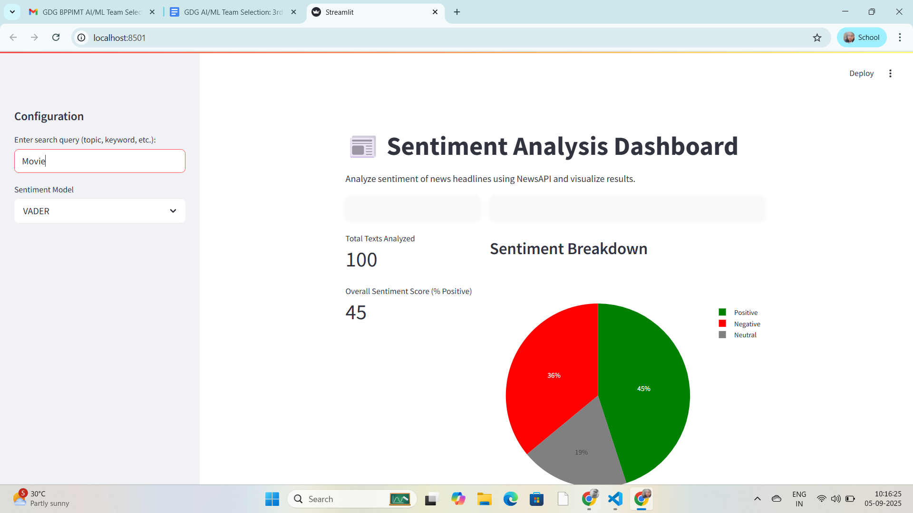

## Project Overview

This project is a dashboard for analyzing the sentiment of news headlines of our search query using state-of-the-art sentiment analysis models. It features a modern Streamlit UI with:
- User search for any topic or keyword
- News headlines fetched from NewsAPI
- Sentiment analysis (VADER/TextBlob)
- Key metrics, pie chart, time-series trends, and word clouds
- Color-coded recent mentions

### Screenshots


.png>)
---

## Data Source & Rationale

**Data Source:** [NewsAPI.org](https://newsapi.org/)

**Why NewsAPI?**
- Reliable, up-to-date news headlines from global sources
- Easy to query by topic, keyword, or country
- Free tier available for development and testing

---

## Sentiment Analysis Model & Rationale

**Models Used:**
- VADER (Valence Aware Dictionary and sEntiment Reasoner)
- TextBlob (optional)

**Why VADER?**
- Designed for short texts and social media
- Handles slang, emojis, and informal language
- Fast and easy to use

**Why TextBlob?**
- Simple API for polarity and subjectivity
- Useful for comparison with VADER

---

## Local Setup & Execution

1. **Clone the repository:**
    ```sh
    git clone https://github.com/Meghali54/Sentiment-Analysis-through-Web-Application.git
    cd sentiment-analysis-worldnews
    ```

2. **Install dependencies:**
    ```sh
    pip install -r requirements.txt
    ```

3. **Run the Streamlit app:**
    ```sh
    streamlit run streamlit_app.py
    ```

4. **Usage:**
    - Enter your search query (topic, keyword, etc.) in the sidebar
    - The app uses NewsAPI to fetch headlines (API key is pre-configured)
    - View sentiment metrics, charts, and word clouds in the dashboard

---

## Requirements

- pandas
- numpy
- matplotlib
- seaborn
- nltk
- pickle
- streamlit
- requests
- json
- plotly
- vaderSentiment
- wordcloud
- textblob

---

## License

This project is licensed under the MIT License. See LICENSE for more information.

---

## Contributing

Contributions are always welcome! If you have any suggestions or would like to add features, please open an issue or create a pull request.

- Clone the repository:
    ```
    git clone https://github.com/hipnologo/sentiment-analysis-worldnews.git
    ```

- Install the required packages:
    ```
    pip install -r requirements.txt
    ```

- Run the script:
    ```
    streamlit run app.py
    ```

- Wait for the news or tweets to load from the API.

- Select a news source or hashtag from the sidebar to filter the headlines or tweets and see the sentiment analysis score for that source or hashtag.

- The dashboard will display a table of the news headlines or tweets and their sentiment scores.

